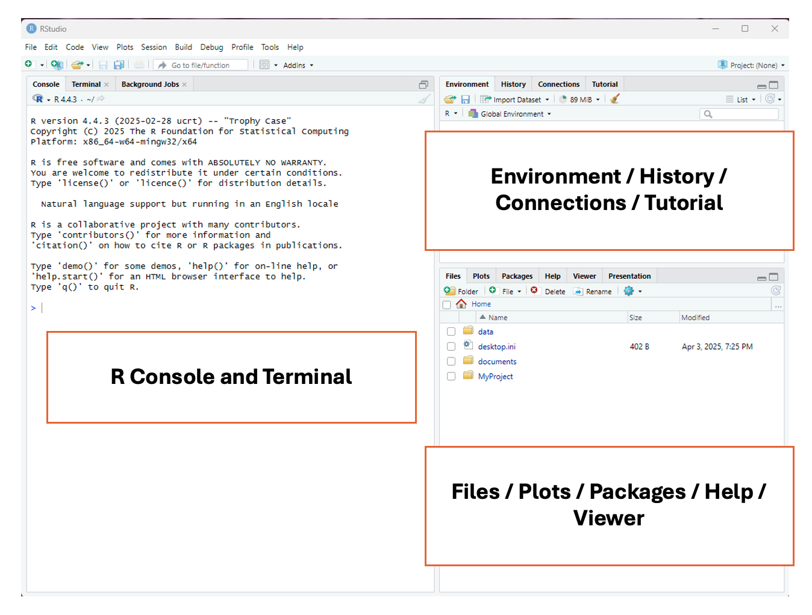
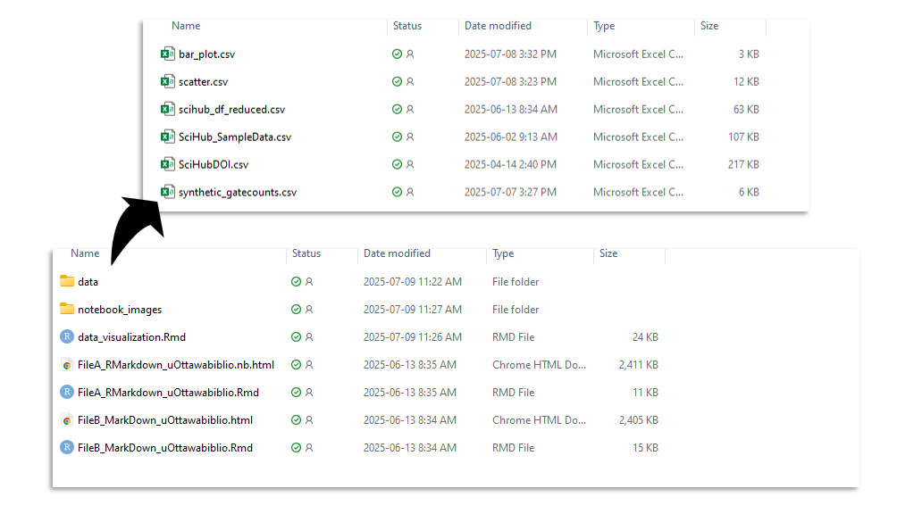
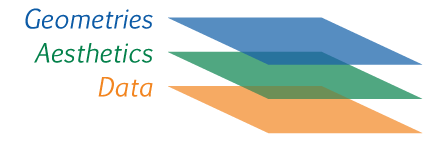
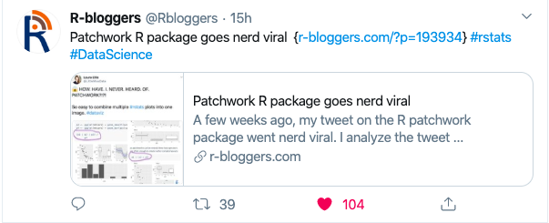

  
# Introduction  

> In this session, we are going to learn some basics about cleaning data in R.
> The folder for this session is available at [https://tinyurl.com/45vxsawu](https://tinyurl.com/45vxsawu).  
> 
> 
>
> For this session you will need:   
> 
> * FileA_RMarkdown_uOttawabiblio.rmd 
>     + *This is the same notebook that I will be showing with the code removed*
>     + *It's not necessary for you to use this file, you can also do it in a completely new notebook or R script* 
>  * data/
>     + SciHub_SampleData.csv  
>     + SciHubDOI.csv  
> 
> There are other files  
>  
> * FileB_MarkDown_uOttawabiblio.rmd  
>   + *this is the same file as above, but with the code already there*   
> * FileB_MarkDown_uOttawabiblio.nb.html 
>   + *this is this the html file of the completed notebook*  
> * notebook_images/ 
>   + *this is just the images that are in the notebook* 
> 
> 
> But first we are going to have a general orientation about R Studio. If you are going through this at a later date, you can watch [this](https://www.youtube.com/watch?v=FIrsOBy5k58) video. 

When you first open R you should see this: 


Once you open a file, you should see this. 


The above images are from the RDM Jumpstart Program. They also have introductory lessons on R, which are available [here](https://alliance-rdm-gdr.github.io/rdm-jumpstart/2-ACT-1-RSetup.html).  

There's 3 key features of R 

1.    R can do operations 

```{r}
125+65
45*76 
8959/32
```
2.    You can assign values to objects. Then do operations on the objects 

```{r}
x=3 
y=6
x*y
```
+ These values can be characters 
```{r}
test_string="uOttawaBiblio"
print(test_string)
```
+ It can also be multiple values, these are what we call lists   
```{r}
test_number_list=c(2,4,6,7,8,3)
test_character_list=c("Spring","Summer","Fall","Winter")
```
+ They can also be dataframes 
```{r eval=FALSE}
df=read.csv("data/testfile.csv")
```

3.    R has functions, and the functions are in packages.  

We have seen a function already. `print()` and `read.csv()` are baseR functions (aka default). The function is the thing outside the brackets, and you perform the function on the argument, which is inside the bracket. 

So, for the example above, the function was `print()`, and the argument was `"test_string"`.  

To get extra functions, you need to download packages. Read more about functions and packages [here](https://bookdown.org/nana/intror/install-and-load-packages.html). 

# Set Up  
## Working Directory 
First, we are going to set ourselves up in a working directory.  

*Note: if you downloaded the whole folder, and you opened one of the provided files, ignore the advice about where to save things. It should all be organized already*   

1. Save the R notebook or R Script file to somewhere that makes sense, this should be the same location where you have the data stored for this session. See the example below. 


2. Select `"Session"` from the top menu bar, then `"Set working directory"` then `"to Source file location"`. The directory should now be printed on the top of the console. See the example below.    

## Installing Tidyverse 

The following examples are going to be done using functions from `tidyverse`. `tidyverse` is a collection of packages that contain functions that are so commonly used for analyses, that people decided to just makes sure that you could download these all at once AND that they would be highly inter operable.You can learn more about `tidyverse` [here](https://r4ds.hadley.nz/data-transform.html) 

  

There are two ways to get a package for the first time, the first is to run `install.packages()` with the package name in the brackets, the second is to go over to the panel on the lower right, hit the `"Packages"` tab, then install and type `"tidyverse" `

You do *not* have to install packages every time, but you *do* need to load them every time using `library()`


Lets load our package: 
```{r}
#this is how you install using code, this is equivalent to going through the Packages panel. I've commented it out since I don't actually need to install 
#install.packages("tidyverse") 
#Loading the package
library(tidyverse) 
```

## Upload Data 
Now, we can load our data, and assign it the name `scihub_df` Then take a look at the first few rows using the `head()` function.There is also a `tail()` function to see the last rows. For more info on uploading data and the different formats you can use, check out [this](https://intro2r.com/importing-data.html) 

I have elected to locate my data by specifying a file path. You could also do it like `scihub_df=read.csv(file.choose())` to open up a file explorer. 
```{r}
#upload the dataset, its located in the data file
scihub_df=read.csv("data/SciHub_SampleData.csv") 
#show the first 6 rows
head(scihub_df) 
```
## Rename Columns       
Looks good, but from experience, those titles column names might make life difficult later, lets rename them to something without spaces. We can then check to make sure the names were changed properly and we didn't mess anything up. 

For more examples of how to rename columns check out [this](https://sparkbyexamples.com/r-programming/rename-column-in-r/) link. 

We can then use the `names()` function to see what the names of the columns are. 
 
```{r}
#change the names of scihub_df. The list needs to be the same length as the number of columns 
colnames(scihub_df)=c("Timestamp",
                 "DOI",
                 "IP_ID",
                 "User_ID",
                 "Country_GeoIP",
                 "City_GeoIP",
                 "Latitude",
                 "Longitude")
#just print the names of columns to confirm they are the new names 
names(scihub_df)
```
 
# Information from Session 2 - Data Tidying 
## Basic Tidying and Analyses
### Selecting Columns   
`tidyverse` uses something called `"pipes"`, which look like `%>%` or `|>`, which tells R to automatically use the last output as the input for the next function. Lets see an example. 

Let's say we only want a subset of the columns in `"scihub_df",` not all 8. We can use the `select()` function to get those

```{r}
#create new dataframe based on scihub_df, just selecting the 3 columns we cant 
scihub_df_reduced=scihub_df%>%
  select(Timestamp,DOI,City_GeoIP)#just selecting these three columns 
#preview the first 6 rows so we can see if it did what we think it did 
head(scihub_df_reduced)
```
### Filtering Rows 
We could also go the other way, and only take certain rows. Let's say we only wanted rows where the city was "Ottawa", we can use the `filter()` function to find those. We can then use the `print()` function so see our new dataframe in the console. 

*Note: this is case sensitive*

```{r}
#making a df that is just for Ottawa
scihub_df_ottawa=scihub_df%>% #using the same original dataset
  filter(City_GeoIP=="Ottawa") #select only the rows with "Ottawa" (case sensitive) int he City_GeoIP column
#print the whole dataset since it's small
print(scihub_df_ottawa)
```

### Summarizing Groups 
There are a lot of basic things we can do. Lets just try getting a summary of how many time each city appears in the dataset. We're going to use the `"scihub_df_reduced"` set (the one where we used `select()` to pick cetain columns). 

We're going to start by using the `group_by()` function. The `group_by()` functions creates groups based on a certain column, and then all subsequent operations (eg. summing, averaging, counting) are done on a *per group* basis. Learn more about `group_by()` [here](https://r4ds.hadley.nz/data-transform.html).

```{r}
city_summary=scihub_df_reduced%>% #using the dataset with 3 columns 
  group_by(City_GeoIP)%>% #make the groups based on city 
  count() #count how many went into each group 
#see first 6 rows (they are automatically sorted alphabetically by grouping variable (aka City_GeoIP))
head(city_summary)
```
If you want to do a little sanity check, the sum of everything in column n should be 1000.      
We can double check like this using the `sum()` function: 
```{r}
sum(city_summary$n)
```
### Fixing Typos 

Did anyone notice anything about the summarized data?  

Yes, we have two different spellings for Montréal.  

Lets fix it.  

We're not going to actually make a new dataset, we're just going to edit what we already did. By adding a new line *before* the `group_by()` where we use a function called `mutate()`. `mutate()` is a very versatile function and can be used for a lot of different applications. You can read more about that [here](https://bookdown.org/yih_huynh/Guide-to-R-Book/mutate.html).  

One thing you can do with `mutate()` is called a `"nested function"` this is where you have a function *inside* another function. In this case we are going to use the `replace()` function. 

The `replace()` function is formatted like this: `replace("column that we need to edit","what values in the column need to be edited,"What we want the new value to be")`  

*Note: there are a lot of different ways to fix typos in data sets, this is just one of many.*   

```{r}
city_summary=scihub_df_reduced%>% #3 column dataset 
  mutate(City_GeoIP = replace(City_GeoIP, City_GeoIP == "Montréal", "Montreal"))%>% #fixing the error 
  group_by(City_GeoIP)%>%#set groups based on the city, same process as above :) 
  count()

```
 If you remember, before we had 76 observations, now we have 75. 

### Dates 
Notice that we have a `timestamp` column, this has both date and the time. Could be useful, but maybe we just want the date. To do this, we are going to load a new package, called `lubridate` which is specifically used for working with date formats. 

```{r}
library(lubridate) #loading a package 
```

We actually have a few ways we could do this.   
1. Use `lubridate` functions   
2. Separate using the space as a delimiter.    
3. Extract the first 10 characters of each row into it's own column   

Let's do the 1st option. We are going to do another nested function with `mutate()` using the `ymd_hms()` function from `lubridate`  
```{r}
scihub_df_reduced_date=scihub_df%>% #start with the original dataset
  select(Timestamp,DOI,City_GeoIP)%>% #select the columns we need 
  mutate(Timestamp=ymd_hms(Timestamp))%>% #make sure the time is interpreted in the correct format 
  mutate(Date=date(Timestamp)) #extract the date 

head(scihub_df_reduced_date) #preview the top 6 
```
### The Separate function 
Lets try it using the `separate()` function to get the time (Option 2)

```{r}
scihub_df_reduced_time=scihub_df%>% #same selection procedure as above 
  select(Timestamp,DOI,City_GeoIP)%>%
  separate(Timestamp, c("Date", "Time"), " ") #separate the date and time based on the space (the blank in between the quotes) and call the two new columns "Date" and "time" 

head(scihub_df_reduced_time)
```


There is also a `paste()` function in R. It's very similar to the concatenate in Excel, and you can learn more about it [here](https://www.digitalocean.com/community/tutorials/paste-in-r).

Finally, you will probably want to save your work after everything. To do this, we can use the `write.csv()` function. 

The format for this is `write.csv(data, filepath)`. After running this, you can check the file location to see if a new file has appeared. 
```{r}
write.csv(scihub_df_reduced,"data/scihub_df_reduced.csv")
```


## Bonus Content if we get time    
### Joins 
So, we have this information about DOI, but what if we want more information? Luckily we have the title and other publication information available from Zotero, and we can export a csv from Zotero and "join" it to our existing dataset. 

This csv is going to have a lot of columns. But maybe we only want DOI (Column 9), Title (Column 5) and Publication Year (Column 3). Before when we selected, we used the names of the columns, but we can also select based on the column number. 

Notice that we were able to pipe the `read.csv` immediately into the `select()`

```{r}
zotero=read.csv("data/SciHubDOI.csv")%>%
  select(9,5,3) #selecting based on position rather than name 
head(zotero)
```

Now, lets join the datasets together. We are using `left_join()` here, but there are lots of different types of joins that you can learn more about [here](https://r4ds.hadley.nz/joins.html#sec-mutating-joins).  

```{r}
scihub_zotero=scihub_df_reduced%>%
  left_join(zotero,by="DOI") #telling it to join the dataset zotero by the values in column DOI 

head(scihub_zotero)
```
### Pivots 

We're going to combine a few things we have seen so far. 
1. making lists.     
2. `group_by()`, but this time we will have TWO groupings.     
3. `filter`, but this time with a list of options and not just one.   

We're going to start with our reduced set. Let's refresh on what it looks like. 

```{r}
head(scihub_df_reduced)
```
We have 3 columns: Timestamp, DOI and City_GeoIP. But maybe we want to see how often each DOI comes up in each city and the organize the information so we have 1 column for each city. 

For the sake of not creating a huge dataset, we're going to only include certain cities. Lets define those using a list. 

```{r}
cities_list=c("Ottawa","Toronto","Montreal","Burnaby")
```

Now we know what we're working with, we can string everything together. 
The final line is `pivot_wider`, it will be easier to explain what it does after you have seen the final product. 
```{r}
scihub_pivot=scihub_df_reduced%>%
  group_by(City_GeoIP,DOI)%>% #group by city and DOI, so we'll get a summary of the doi count per city 
  count()%>%
  filter(City_GeoIP %in% cities_list)%>% #filter, but only keep values that appear in cities_list
  pivot_wider(id_cols=DOI,names_from=City_GeoIP,values_from=n)#here is the pivot, we say that the rows should be based on DOI, the new column names are going to be the city, and the values in the cells are the counts of that DOI in that city

head(scihub_pivot)
```
# Session 3 Content -Data Visualization

This is going to be a basic overview of making your some basic plots in ggplot. We will cover 

* Scatterplots 
* Bar Plots 
* Box Plots 
* Violin Plots 
* Density Plots 
   + The aesthetics that go with them 
   
On this page, I have gone through and collected material that I have found to be the most helpful when learning ggplot. All of these will linked as we go through.If you want any more information on a particular topic, those would be great places to start. 

First step will be to load all the libaries we might need. Make sure these are installed (if you don't know how to install packages look [here](https://www.datacamp.com/community/tutorials/r-packages-guide)) or see the earlier part of this lesson [here](## Installing Tidyverse)

`ggplot2` is part of the `tidyverse` suite of packages, I like to install the whole thing at once in case I need to do any data tidying before plotting. An optional install for this lesson is `patchwork`, it is a nice package for laying out multiple plots,but it's not necessary for today's lesson. 


```{r echo = T, message=FALSE}
library(tidyverse)
library(patchwork)
```
## A few notes on ggplot 

* The [ggplot cheatsheet](https://rstudio.com/wp-content/uploads/2015/03/ggplot2-cheatsheet.pdf)
* ggplot has 
  + data 
  + aesthetics
    + size 
    + transparency 
    + colour 
    + fill
  + geometries 
    + `geom_point()`
    + `geom_bar()`
    + `geom_boxplot()`
    + `geom_text()`
    + `geom_violin()`
    + any many more 

  



## Basic Anatomy of a ggplot

Much like how we could assign values to variables, and then call up those variables and perform operations on those variables, we can also assign plots to variables. You do this in the same way, we see below how I assign the plot to the variable `p`. If you assign to a variable, you will have to call the variable in order for the plot to appear. 
```{r eval=FALSE}
p=ggplot(aes(aes1,aes2))+ #these are global aesthetics that will apply to all the points (required)
    geom_X(aes(aes1,aes2))+ #X=point|bar|violin|etc, you can have many `geom`s in one plot (required)
    theme() # a lot of your specifications will go here (not required)
  
p #this is how you get your plot to show up 
```
You could also just get the plot to show up automatically if you don't set it to an object 
```{r eval=FALSE}
ggplot(aes(aes1,aes2))+ 
    geom_X(aes(aes1,aes2))+ 
    theme()
```

## Scatter Plots 


Scatterplots are an excellent first plot to start off with. There are lots of ways to manipulate scatterplots to give very informative figures-which you will see farther down on this page. 

The data and further information on making scatterplots can be found [here](https://www.r-graph-gallery.com/320-the-basis-of-bubble-plot.html). 

First thing first, load the data. What I have written in this chunk may not work for you if you have downloaded the data separately. You can also do `scatter=read.csv(file.choose())` to open a file navigation window and select from there. 

As with anything, its always a good idea to look at the data and make sure it uploaded properly before you start plotting. This also makes sure you know what the column names are. You can see more about using `head()` in the code from [session 2](## Uploading data)
```{r}
scatter=read.csv(("data/scatter.csv"))
head(scatter)
```

### Basic Scatter Pot 

```{r}
ggplot(scatter,aes(x=Lib_Budget,y=Collection_Size))+
  geom_point()

```

### Scatter plot with trendline 

Sometimes you want to add a trendline.For more information on how to get a line of best fit see the documentation for [`geom_smooth`](https://ggplot2.tidyverse.org/reference/geom_smooth.html)

```{r}
ggplot(scatter,aes(x=Lib_Budget,y=Collection_Size))+
  geom_point()+
  geom_smooth(method="lm")
```

### Scatter plot with different aes for the points 

When you have a lot of nice metadata associated with the variables you are plotting. It is nice to incorporate these into your figures. 
You can normally change 

* Shape 
* Colour 
* Fill 
* Alpha 
* Size 

Note: We have taken the log() away from the X value. 

Let's change the colour of the points based on `contient` and scale the points based on `pop`
```{r}
ggplot(scatter,aes(x=Lib_Budget,y=Collection_Size))+
  geom_point(aes(colour=Country,size=Enrollment))
```

Lets change the shape of the points 

```{r}
ggplot(scatter,aes(x=Lib_Budget,y=Collection_Size))+
  geom_point(aes(shape=Country,size=Enrollment))
```

You can see we get a lot of strange shapes. You can specify the shapes you want by using a number code. You can find all those [here](https://www.datanovia.com/en/blog/ggplot-point-shapes-best-tips/)


Whats the difference between fill and colour? Also why are there different versions of the same shape? 

```{r echo=FALSE}
shape_21=ggplot(scatter,aes(x=Lib_Budget,y=Collection_Size))+
  geom_point(aes(shape=Country,color=Country,size=Enrollment),shape=21)+
  ggtitle("colour with shape 21")+
  theme(legend.position = "none")
shape_16=ggplot(scatter,aes(x=Lib_Budget,y=Collection_Size))+
  geom_point(aes(shape=Country,color=Country,size=Enrollment),shape=16)+
  ggtitle("colour with shape 16")+
  theme(legend.position = "none")
shapef_21=ggplot(scatter,aes(x=Lib_Budget,y=Collection_Size))+
  geom_point(aes(shape=Country,fill=Country,size=Enrollment),shape=21)+
  ggtitle("fill with shape 21")+
  theme(legend.position = "none")
shapef_16=ggplot(scatter,aes(x=Lib_Budget,y=Collection_Size))+
  geom_point(aes(shape=Country,fill=Country,size=Enrollment),shape=16)+
  ggtitle("fill with shape 16")+
  theme(legend.position = "none")

(shape_16|shape_21)/(shapef_16|shapef_21)
```

## Bar Charts and Violin Plots

What I have written in this chunk may not work for you. You may have to do something along the lines of `bar=read.csv(file.choose())` and then select the `bar_plot.csv` from wherever you saved it on your computer. 

The dataset we will be using is looking at how much sleep students in different years of school get (in minutes) at different times in the year. 

### Bar Chart 

More information on making bar charts can be found [here](http://www.sthda.com/english/wiki/ggplot2-barplots-quick-start-guide-r-software-and-data-visualization)


```{r}
bar=read.csv(("data/bar_plot.csv"))
head(bar)
```

There are a lot of ways you can display a bar chart. It's very easy to switch between them. 

All of these will have `stat="summary"` and `fun.y="mean"` in the `geom_bar()`, this is how we can make sure we are plotting the means of each category. 

### Grouped Bar Chart 
```{r}
ggplot(bar, aes(x=time,y=minutes,fill=year))+geom_bar(position="dodge",stat = "summary",fun="mean")
```

### Stacked Bar Chart 

Changing the position will allow us to have different types of bar charts. To get it stacked, use `position="stack"`.

```{r}
ggplot(bar, aes(x=time,y=minutes,fill=year))+geom_bar(position="stack",stat = "summary", fun= "mean")
```

### Percent Bar Chart 

```{r}
ggplot(bar, aes(x=time,y=minutes,fill=year))+geom_bar(position="fill",stat = "summary", fun= "mean")
```

To summarize: 

* grouped bar chart: `position="dodge"`
* stacked bar chart: `position="stack"`
* percent bar chart: `position="fill"`

### Box and Whisker Plot 

Box and Whisker plots are considered an improvement over the barplot because they give a better idea of the spread of the data. You can see the mean, quartiles and outliers, these are not evident with the bar plot. 

More information on making box and whisker plots can be found [here](http://www.sthda.com/english/wiki/ggplot2-box-plot-quick-start-guide-r-software-and-data-visualization)

```{r}
ggplot(bar, aes(x=time,y=minutes,fill=year))+geom_boxplot()
```

### Violin Plot 

Violin plots are sometimes considered another level up from the box and whisker (so to keep track bar<box<violin) since it gives a better (more visual) idea of how the points are distributed. 

More information on violin plots can be found [here](http://www.sthda.com/english/wiki/ggplot2-violin-plot-quick-start-guide-r-software-and-data-visualization)


```{r}
ggplot(bar, aes(x=time,y=minutes,fill=year))+
  geom_violin()
```

You may have noticed that for all of these, the axis are in the order final, midterm, week2. While not a big deal, it would be nice if they were week2, midterm, final. We are going to get into how to change that later. For now, we will stick to the basic plots. 

## Layering Plots 

You can also combine different types of plots and and layer them on top of each other. For example, maybe we like the overview that a violin plot gives, but still want to see the actual numbers. 

```{r}
ggplot(bar, aes(x=time,y=minutes))+
  geom_violin(alpha=0.8)+
  geom_jitter(width = 0.15)
```
Lets look at the impact of the order in which we called the layers. In the above example, we called the `geom_violin()` before we called `geom_point()`, lets try the other way around. 
```{r}
ggplot(bar, aes(x=time,y=minutes))+
  geom_jitter(width = 0.15)+
  geom_violin(alpha=0.8)
  
```

Because I made the violins transparent (thats what the alpha is for), we can see that the violins were placed on top of the points, instead of the points being on top of the violins. 

## Customizing your Plots

This is the same plot we made above, we haven't added any customizations. 
```{r}
ggplot(scatter,aes(x=Lib_Budget,y=Collection_Size))+
  geom_point(aes(colour=Country,size=Enrollment))+
  xlab("Library Budget")+
  ylab("Collection Size")
```

### Themes 

There are a lot of different themes you can use when making your plots. You can see a description of them all [here](https://ggplot2.tidyverse.org/reference/ggtheme.html), and I'll show you some examples below.

```{r}
ggplot(scatter,aes(x=Lib_Budget,y=Collection_Size))+
  geom_point(aes(colour=Country,size=Enrollment))+
  xlab("Library Budget")+
  ylab("Collection Size")+
  theme_bw()
```

```{r }
scatter_bw=ggplot(scatter,aes(x=Lib_Budget,y=Collection_Size))+
  geom_point(aes(colour=Country,size=Enrollment))+
  xlab("Library Budget")+
  ylab("Collection Size")+
  ggtitle(("theme_bw"))+
  theme_bw()+
  theme(legend.position = "none")
scatter_light=ggplot(scatter,aes(x=Lib_Budget,y=Collection_Size))+
  geom_point(aes(colour=Country,size=Enrollment))+
  xlab("Library Budget")+
  ylab("Collection Size")+
  ggtitle("theme_classic")+
  theme_classic()+
  theme(legend.position = "none")
scatter_dark=ggplot(scatter,aes(x=Lib_Budget,y=Collection_Size))+
  geom_point(aes(colour=Country,size=Enrollment))+
  xlab("Library Budget")+
  ylab("Collection Size")+
  ggtitle("theme_dark")+
  theme_dark()+
  theme(legend.position = "none")
scatter_minimal=ggplot(scatter,aes(x=Lib_Budget,y=Collection_Size))+
  geom_point(aes(colour=Country,size=Enrollment))+
  xlab("Library Budget")+
  ylab("Collection Size")+
  ggtitle("theme_minimal")+
  theme_minimal()+
  theme(legend.position = "none")
```

### Patchwork 



`Patchwork` is a lovely package that allows you to very simply arrange your plots in whatever manner you like. See the documentation [here](https://github.com/thomasp85/patchwork). You can see an example of how you would use it below. 

```{r}
(scatter_bw|scatter_light)/(scatter_dark|scatter_minimal)
```
```{r}
ggplot(scatter,aes(x=Lib_Budget,y=Collection_Size))+
  geom_point(aes(colour=Country,size=Enrollment))+
  xlab("Library Budget")+
  ylab("Collection Size")+
  ggtitle("Removing All Gridlines")+
  theme_bw()+
  theme(panel.grid = element_blank())
```
```{r}
ggplot(scatter,aes(x=Lib_Budget,y=Collection_Size))+
  geom_point(aes(colour=Country,size=Enrollment))+
  xlab("Library Budget")+
  ylab("Collection Size")+
  ggtitle("Removing All Vertical Lines")+
  theme_bw()+
  theme(panel.grid.major.x = element_blank(),
        panel.grid.minor.x = element_blank())
```
### Modifying the legend 

There are a lot of ways you can change the legend. You will probably need to do some research for your specific use case. There are options in `theme()` and options in `guide()` and a lot of others. 

[This](http://www.cookbook-r.com/Graphs/Legends_(ggplot2)/) is normally where I go when I first start troubleshooting my legend problems. 

```{r}
ggplot(scatter,aes(x=Lib_Budget,y=Collection_Size))+
  geom_point(aes(colour=Country,size=Enrollment))+
  xlab("Library Budget")+
  ylab("Collection Size")+
  ggtitle("Renaming the Legends")+
  guides(colour=guide_legend(title="Country"),size=guide_legend(title="Enrollment"))+
  theme_bw()+
  theme(panel.grid.major.x = element_blank(),
        panel.grid.minor.x = element_blank())
```

### Colouring 

Everybody's favourite part of plotting. There is A LOT of different ways you can colour your plots. So I advise you explore this when the time comes, but there are a lot of pre-set colour schemes that look great and are easy to implement. You can find resources on them [here](http://www.sthda.com/english/wiki/ggplot2-colors-how-to-change-colors-automatically-and-manually)

```{r}
ggplot(scatter,aes(x=Lib_Budget,y=Collection_Size))+
  geom_point(aes(colour=Country,size=Enrollment))+
  xlab("Library Budget")+
  ylab("Collection Size")+
  scale_colour_viridis_d()+
  ggtitle("Scatterplot with Viridis Colouring")+
  guides(colour=guide_legend(title="Country"),size=guide_legend(title="Enrollment"))+
  theme_bw()+
  theme(panel.grid.major.x = element_blank(),
        panel.grid.minor.x = element_blank())
```
```{r}
ggplot(scatter,aes(x=Lib_Budget,y=Collection_Size))+
  geom_point(aes(colour=Country,size=Enrollment))+
  xlab("Library Budget")+
  ylab("Collection Size")+
  scale_colour_brewer(palette = "Paired")+
  ggtitle("Scatterplot with Colour Brewer")+
  guides(colour=guide_legend(title="Country"),size=guide_legend(title="Enrollment"))+
  theme_bw()+
  theme(panel.grid.major.x = element_blank(),
        panel.grid.minor.x = element_blank())
```

If you're going to get into manual colouring look [here](http://www.stat.columbia.edu/~tzheng/files/Rcolor.pdf) to figure out what kind of colours are available. 
```{r}
ggplot(scatter,aes(x=Lib_Budget,y=Collection_Size))+
  geom_point(aes(colour=Country,size=Enrollment))+
  xlab("Library Budget")+
  ylab("Collection Size")+
  scale_colour_manual(values=c("orangered3","slateblue","lightseagreen","orchid3","sienna2","dodgerblue"))+
  ggtitle("Scatterplot with Manual Colours")+
  guides(colour=guide_legend(title="Country"),size=guide_legend(title="Enrollment"))+
  theme_bw()+
  theme(panel.grid.major.x = element_blank(),
        panel.grid.minor.x = element_blank())
```

If you are hoping to apply a specific colour to a specific category you can do it like this. 

```{r}
ggplot(scatter,aes(x=Lib_Budget,y=Collection_Size))+
  geom_point(aes(colour=Country,size=Enrollment))+
  xlab("Library Budget")+
  ylab("Collection Size")+
  scale_colour_manual(values=c(India="orangered3",Italy="slateblue",Japan="lightseagreen",Netherlands="orchid3",Sweden="sienna2",UK="dodgerblue"))+
  ggtitle("Scatterplot with Manual Colours-Assigned to Continent")+
  guides(colour=guide_legend(title="Country"),size=guide_legend(title="Enrollment"))+
  theme_bw()+
  theme(panel.grid.major.x = element_blank(),
        panel.grid.minor.x = element_blank())
```

### Facets 

Sometimes when you have a lot of data it can be useful to facet your plots. This is really easy! As you can see below. The different options for facets can be seen [here](https://www.datacamp.com/community/tutorials/facets-ggplot-r)

```{r}
ggplot(scatter,aes(x=Lib_Budget,y=Collection_Size))+
  geom_point(aes(colour=Country,size=Enrollment))+
  xlab("Library Budget")+
  ylab("Collection Size")+
  guides(colour=guide_legend(title="Country"),size=guide_legend(title="Enrollment"))+
  theme_bw()+
  theme(panel.grid.major.x = element_blank(),
        panel.grid.minor.x = element_blank())+
  facet_grid(~Country)
```

You can see that the facet made our x-axis labels difficult to see. Luckily this is one of the many elements we can fix in `theme()`

```{r}
ggplot(scatter,aes(x=Lib_Budget,y=Collection_Size))+
  geom_point(aes(colour=Country,size=Enrollment))+
  xlab("Library Budget")+
  ylab("Collection Size")+
  guides(colour=guide_legend(title="Country"),size=guide_legend(title="Enrollment"))+
  theme_bw()+
  theme(panel.grid.major.x = element_blank(),
        panel.grid.minor.x = element_blank(),
        axis.text.x = element_text(angle=45,vjust=0.5))+
  facet_grid(~Country)
```

### Changing Factor Levels

Remember up above with our bar plot we saw that the categories for the sleep dataset weren't in the right order. We are going to reset the [factor levels](http://www.cookbook-r.com/Manipulating_data/Changing_the_order_of_levels_of_a_factor/) and then it should plot properly. 


We'll start with a basic plot of the old factor levels
```{r}
bar_ofl=ggplot(bar, aes(x=time,y=minutes,fill=year))+geom_bar(position="dodge",stat="identity")
```

Now lets reset the factor levels, then do the same plot again, and then compare the two 
```{r}
bar$time <- factor(bar$time,levels = c("week2","midterm","final"))
bar_rfl=ggplot(bar, aes(x=time,y=minutes,fill=year))+geom_bar(position="dodge",stat="identity")
(bar_ofl|bar_rfl)
```


## Trouble shooting 

* check the order of your layers 
* check the class of the columns you are trying to use using `class()`
* check the factor levels with `levels()`
* to check how many of each category you have use `table(df$col)`


## Other Fun examples 

R also allows you to make animated vizualizations. For example we can look at the number of library visitors over a period of time: 

```{r eval=FALSE}
data=read.csv("data/synthetic_gatecounts.csv")%>%
  dplyr::select(name,date,visitors)%>%
  mutate(Timestamp=ymd_hm(date))%>% #make sure the time is interpreted in the correct format 
  mutate(Date=date(Timestamp))%>% #extract the date 
  dplyr::select(name,Date,visitors)

# Calculate cumulative visitors
data_cumulative <- data %>%
  arrange(name, Date) %>%
  group_by(name) %>%
  mutate(cumulative_visitors = cumsum(visitors)) %>%
  ungroup()

# Create animated bar plot
plot <- ggplot(data_cumulative, aes(x = reorder(name, -cumulative_visitors), 
                                    y = cumulative_visitors, 
                                    fill = name)) +
  geom_col(show.legend = FALSE) +
  labs(title = 'Cumulative Visitors by Place',
       subtitle = 'Date: {frame_time}',
       x = 'Name',
       y = 'Cumulative Visitors') +
  scale_y_continuous(labels = scales::comma) +
  transition_time(Date) +
  ease_aes('linear') +
  theme_minimal(base_size = 16)

# Animate
animate(plot, nframes = 100, fps = 10, width = 800, height = 600)

```


